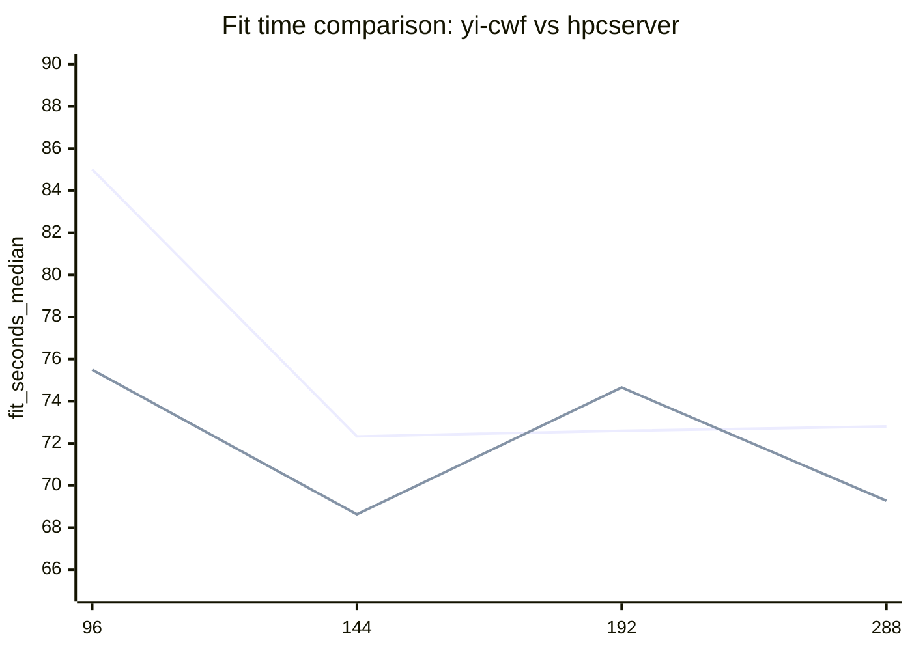
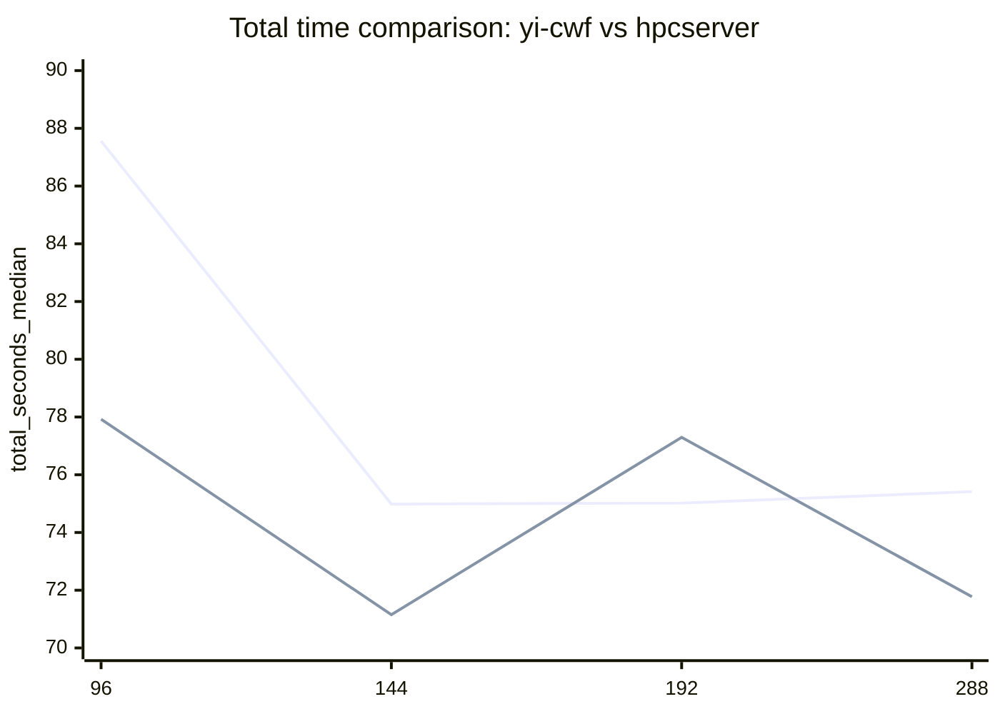
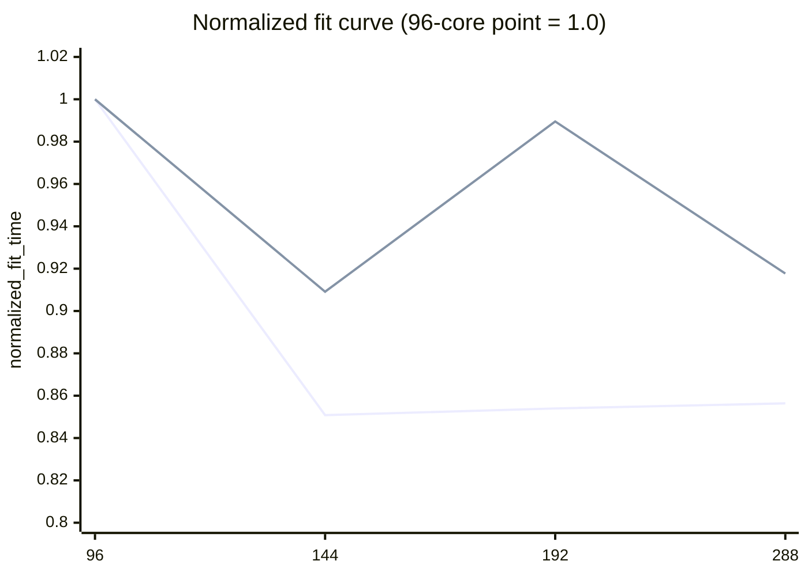
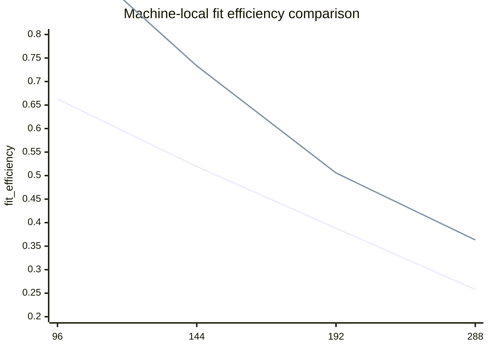

# Scaling comparison: yi-cwf vs 10.239.83.184 / hpcserver

This page compares the measured DeepForest scaling curves on two different servers using the same workload:
- OpenML dataset 159 (`RandomRBF_50_1E-3`)
- DeepForest 0.1.7
- single measured run per point in these scaling sweeps

Sources:
- yi-cwf scaling results: `results/ddr_scaling_48to288_v1/scaling_analysis.json`
- hpcserver scaling results: `results/scaling_184_96to288_v2/scaling_analysis.json`
- yi-cwf report: `docs/ddr-scaling-48to288.md`
- hpcserver report: `docs/scaling-184-96to288.md`
- OpenML dataset metadata: https://www.openml.org/
- DeepForest package reference: https://pypi.org/project/deep-forest/0.1.7/

## Machines

### yi-cwf
- host: `cwf-bkc`
- CPU: `Intel(R) Xeon 6992E+C`
- topology: `1 socket`, `288 cores`, `1 thread/core`, `3 NUMA nodes`
- measured sweep points: `48, 96, 144, 192, 240, 288`

### hpcserver (10.239.83.184)
- host: `hpcserver`
- CPU: `Intel(R) Xeon(R) 6966P-C`
- topology: `2 sockets`, `96 cores/socket`, `2 threads/core`, `384 CPUs visible`, `6 NUMA nodes`
- measured sweep points: `96, 144, 192, 288`

## Best tested point

Both machines peak at `144` cores for this workload.

- yi-cwf best fit: `72.330963 s` at `144` cores
- hpcserver best fit: `68.629826 s` at `144` cores

So on the common best point, `hpcserver` is faster by about `3.70 s`.

## Common-point table (96 / 144 / 192 / 288)

| n_jobs | yi-cwf fit_s | hpcserver fit_s | yi-cwf total_s | hpcserver total_s |
|---:|---:|---:|---:|---:|
| 96  | 85.015907 | 75.494157 | 87.559239 | 77.926184 |
| 144 | 72.330963 | 68.629826 | 74.984700 | 71.152916 |
| 192 | 72.599859 | 74.652356 | 75.017511 | 77.295707 |
| 288 | 72.804610 | 69.277085 | 75.413918 | 71.775358 |

## Fit-time comparison chart (common points)

Legend:
- line 1 = `yi-cwf`
- line 2 = `hpcserver`

## Total-time comparison chart (common points)

Legend:
- line 1 = `yi-cwf`
- line 2 = `hpcserver`

## Normalized fit-time chart (96-core baseline = 1.0 on each machine)

This chart compares shape rather than absolute runtime.

- yi-cwf normalized fit curve from the 96-core point:
  - `96: 1.000000`
  - `144: 0.850801`
  - `192: 0.853964`
  - `288: 0.856376`
- hpcserver normalized fit curve from the 96-core point:
  - `96: 1.000000`
  - `144: 0.909108`
  - `192: 0.989511`
  - `288: 0.917682`

Legend:
- line 1 = `yi-cwf`
- line 2 = `hpcserver`

## Efficiency comparison chart

To compare parallel efficiency directly, use the machine-local baselines from each sweep:
- yi-cwf baseline = `48` cores
- hpcserver baseline = `96` cores

Legend:
- line 1 = `yi-cwf` (relative to 48-core baseline)
- line 2 = `hpcserver` (relative to 96-core baseline)

## Observations

1. Both machines prefer `144` cores.
- This is the strongest common conclusion.
- For this workload, neither machine gets its best runtime at the highest tested core count.

2. `hpcserver` is faster at `96`, `144`, and `288`.
- `96`: 75.49s vs 85.02s
- `144`: 68.63s vs 72.33s
- `288`: 69.28s vs 72.80s

3. `yi-cwf` is better at `192`.
- `yi-cwf`: 72.60s
- `hpcserver`: 74.65s
- This suggests `hpcserver` has a more irregular high-core curve, likely due to multi-socket / NUMA placement effects.

4. yi-cwf scales more smoothly after 144.
- It flattens, but remains stable from `144 -> 288`.
- hpcserver dips at `144`, degrades sharply at `192`, then partially recovers at `288`.

5. hpcserver still wins on absolute best runtime.
- Best common point is `144`.
- `68.63s` on hpcserver vs `72.33s` on yi-cwf.

## Practical takeaway

If you want one operating point to compare across both machines, use:
- `144` cores

If you want to study high-core behavior and topology sensitivity, compare:
- `144`, `192`, `288`

If you want to study memory-configuration effects on `yi-cwf`, the existing conclusion still holds:
- `144` is the sweet spot on DDR
- `288` does not buy extra performance on this workload
- future MRDIMM testing should explicitly check whether the saturation point moves rightward beyond `144`
