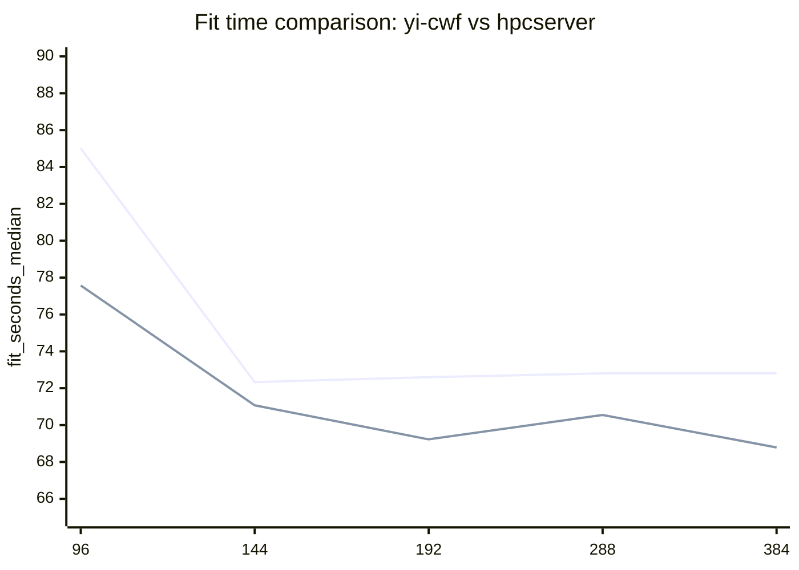
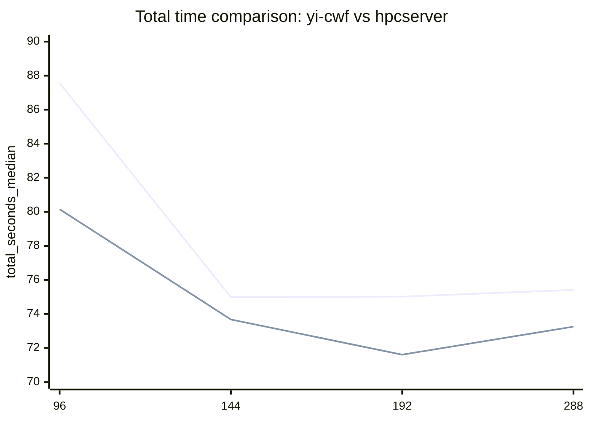
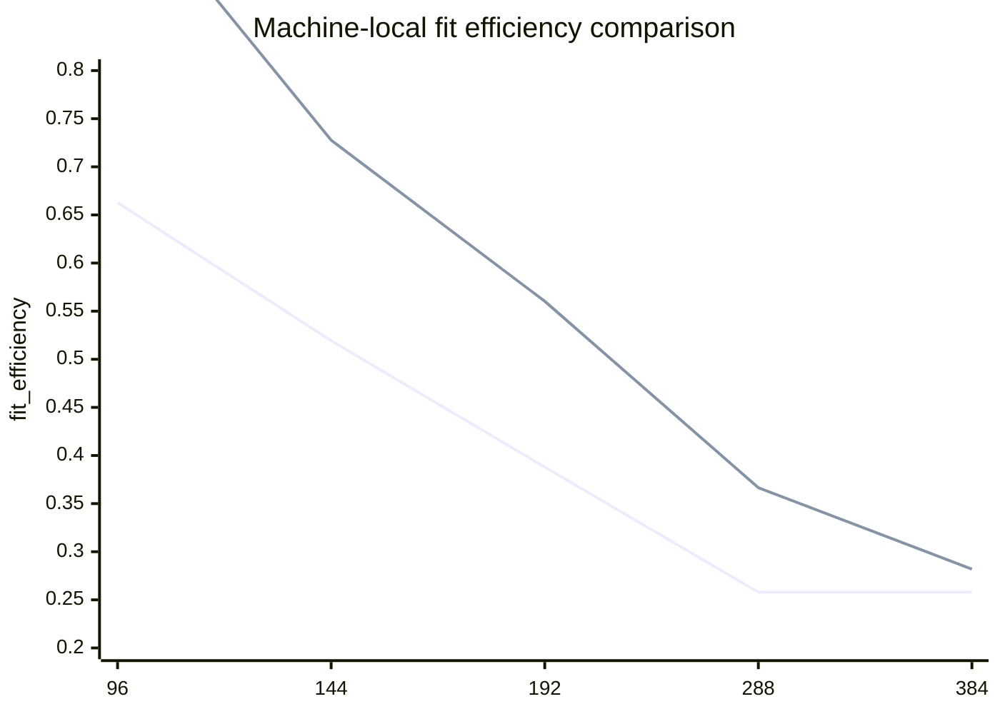

# Scaling comparison: yi-cwf vs 10.239.83.184 / hpcserver

This page compares the measured DeepForest scaling curves on two different servers using the same workload:
- OpenML dataset 159 (`RandomRBF_50_1E-3`)
- DeepForest 0.1.7
- single measured run per point in these scaling sweeps

Sources:
- yi-cwf scaling results: `results/ddr_scaling_48to288_v1/scaling_analysis.json`
- hpcserver scaling results: `results/scaling_184_96to384_v1/scaling_analysis.json`
- yi-cwf report: `docs/ddr-scaling-48to288.md`
- hpcserver report: `docs/scaling-184-96to384.md`
- OpenML dataset metadata: https://www.openml.org/
- DeepForest package reference: https://pypi.org/project/deep-forest/0.1.7/

## Machines

### yi-cwf
- host: `cwf-bkc`
- CPU: `Intel(R) Xeon 6992E+C`
- topology: `1 socket`, `288 cores`, `1 thread/core`, `3 NUMA nodes`
- measured sweep points: `48, 96, 144, 192, 240, 288`

### hpcserver (10.239.83.184)
- host: `hpcserver`
- CPU: `Intel(R) Xeon(R) 6966P-C`
- topology: `2 sockets`, `96 cores/socket`, `2 threads/core`, `384 CPUs visible`, `6 NUMA nodes`
- measured sweep points: `96, 144, 192, 288, 384`

## Best tested point

The two machines no longer peak at the same point.

- yi-cwf best fit: `72.330963 s` at `144` cores
- hpcserver best fit: `68.785441 s` at `384` vCPU

So:
- `yi-cwf` peaks at `144`
- `hpcserver` continues improving and reaches its best tested time at the full `384` visible vCPU point

## Common-point table (96 / 144 / 192 / 288)

| n_jobs | yi-cwf fit_s | hpcserver fit_s | yi-cwf total_s | hpcserver total_s |
|---:|---:|---:|---:|---:|
| 96  | 85.015907 | 77.574735 | 87.559239 | 80.152939 |
| 144 | 72.330963 | 71.073055 | 74.984700 | 73.673592 |
| 192 | 72.599859 | 69.226232 | 75.017511 | 71.610131 |
| 288 | 72.804610 | 70.550359 | 75.413918 | 73.254292 |

## Fit-time comparison chart

Legend:
- line 1 = `yi-cwf` (384 not measured; held flat at the 288 value for visual boundary only)
- line 2 = `hpcserver`

## Total-time comparison chart

Legend:
- line 1 = `yi-cwf`
- line 2 = `hpcserver`

## Efficiency comparison chart

To compare parallel efficiency directly, use the machine-local baselines from each sweep:
- yi-cwf baseline = `48` cores
- hpcserver baseline = `96` cores

Legend:
- line 1 = `yi-cwf` (384 not measured; held flat at the 288 value for visual boundary only)
- line 2 = `hpcserver`

## Observations

1. The two machines diverge at the top end.
- `yi-cwf` peaks at `144` and then stays roughly flat/slightly worse.
- `hpcserver` keeps improving enough to make `384` its best tested point.

2. hpcserver is faster than yi-cwf at all common high-core points in this updated sweep.
- `96`: 77.57s vs 85.02s
- `144`: 71.07s vs 72.33s
- `192`: 69.23s vs 72.60s
- `288`: 70.55s vs 72.80s

3. yi-cwf is smoother.
- Its curve improves sharply up to `144`, then flattens cleanly.
- hpcserver shows more shape changes: down at `192`, up at `288`, down again at `384` to a new best.

4. Absolute best runtime now clearly belongs to hpcserver.
- `68.79s` at `384`
- vs `72.33s` at yi-cwf's best `144`

5. Efficiency still falls on both machines.
- hpcserver wins on absolute time at `384`, but the efficiency there is only `0.281945` relative to its 96-core baseline.
- So the extra speed comes with poor parallel efficiency.

## Practical takeaway

If you want one operating point to compare across both machines, use:
- `144` cores

If you want to study machine-specific high-core behavior, compare:
- `144`, `192`, `288`
- and on `hpcserver` also include `384`

If you want to study memory-configuration effects on `yi-cwf`, the existing conclusion still holds:
- `144` is the sweet spot on DDR
- `288` does not buy extra performance on this workload
- future MRDIMM testing should explicitly check whether the saturation point moves rightward beyond `144`

If you want to study scheduler / topology sensitivity on `hpcserver`, the new conclusion is:
- full `384` vCPU should be kept as an explicit benchmark point
- because on this host, the best tested time now occurs at the full-vCPU point rather than an intermediate core count
