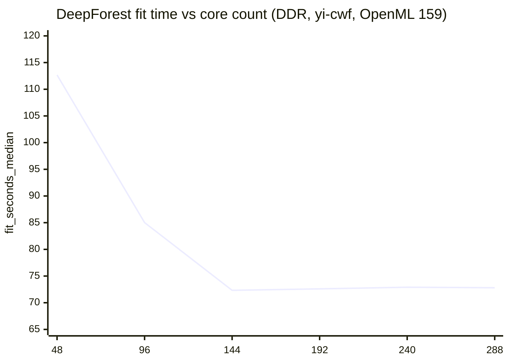
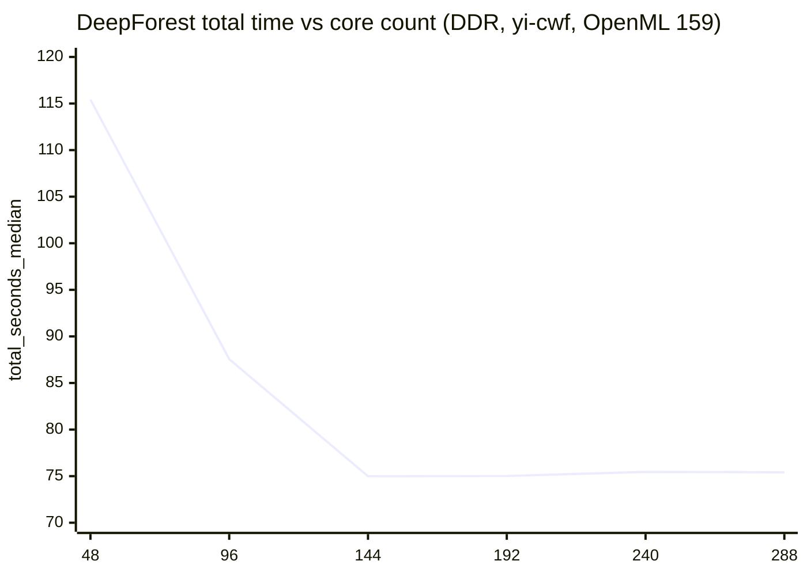
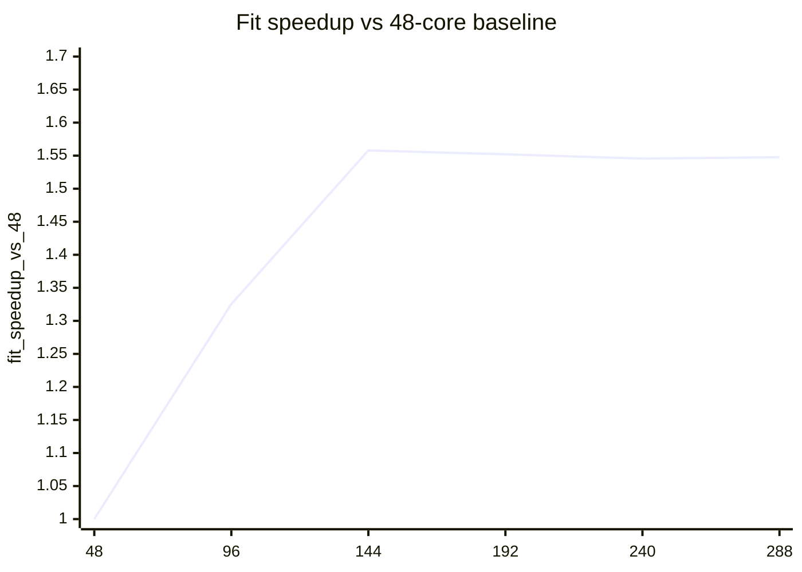
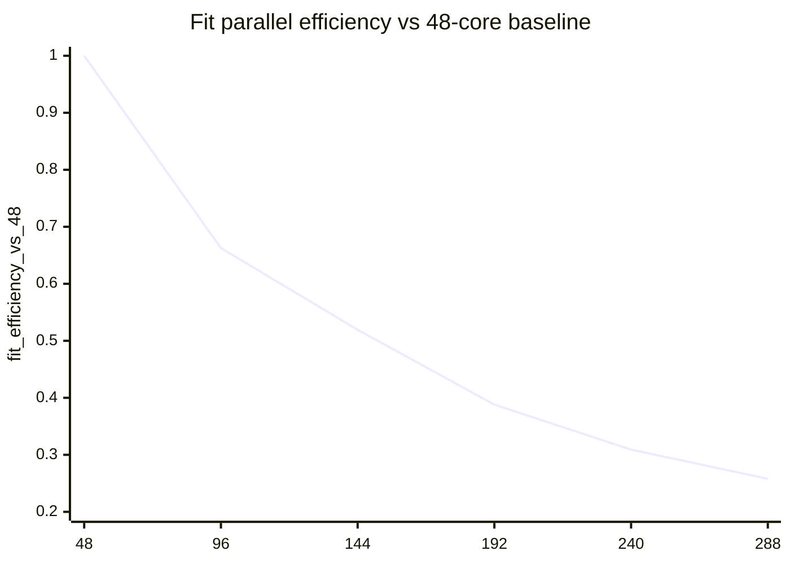

# DDR scaling analysis on yi-cwf (OpenML 159, DeepForest)

This note summarizes the real `n_jobs` scaling sweep collected on `yi-cwf` for the current DDR configuration.

Sources:
- raw scaling summary: `results/ddr_scaling_48to288_v1/scaling_analysis.json`
- terminal table: `results/ddr_scaling_48to288_v1/scaling_analysis.txt`
- representative run summaries:
  - `results/ddr_scaling_48to288_v1/summary_n144.json`
  - `results/ddr_scaling_48to288_v1/summary_n288.json`
- dataset metadata: OpenML dataset 159 (`RandomRBF_50_1E-3`) https://www.openml.org/
- DeepForest package reference: https://pypi.org/project/deep-forest/0.1.7/

Test conditions:
- host: `yi-cwf` / `cwf-bkc`
- workload: OpenML did `159`
- core points: `48, 96, 144, 192, 240, 288`
- repeats per point: `1`
- warmup runs: `0`
- baseline point for scaling analysis: `48` cores

## Key result

- Best fit time: `144` cores, `72.330963 s`
- Best total time: `144` cores, `74.984700 s`
- `288` cores is effectively flat vs `144` cores (`72.804610 s` vs `72.330963 s`)
- Accuracy is constant at `53.4095%` across all tested core counts

Interpretation:
- Scaling is meaningful from `48 -> 96 -> 144`
- After `144` cores, the workload has already saturated on this DDR configuration
- Extra cores beyond `144` mostly reduce efficiency rather than runtime

## Raw table

| n_jobs | fit_seconds_median | total_seconds_median | fit_speedup_vs_48 | fit_efficiency_vs_48 | total_speedup_vs_48 | total_efficiency_vs_48 |
|---:|---:|---:|---:|---:|---:|---:|
| 48  | 112.682055 | 115.421988 | 1.000000 | 1.000000 | 1.000000 | 1.000000 |
| 96  | 85.015907  | 87.559239  | 1.325423 | 0.662712 | 1.318216 | 0.659108 |
| 144 | 72.330963  | 74.984700  | 1.557867 | 0.519289 | 1.539274 | 0.513091 |
| 192 | 72.599859  | 75.017511  | 1.552097 | 0.388024 | 1.538601 | 0.384650 |
| 240 | 72.910415  | 75.461539  | 1.545486 | 0.309097 | 1.529547 | 0.305909 |
| 288 | 72.804610  | 75.413918  | 1.547732 | 0.257955 | 1.530513 | 0.255086 |

## Fit-time chart

## Total-time chart

## Speedup chart

## Efficiency chart

## Reading guide

What the charts show:
- The fit-time and total-time curves drop steeply up to `144` cores, then flatten.
- The speedup curve peaks early and stops improving after `144` cores.
- The efficiency curve falls monotonically, which is typical when a workload becomes constrained by memory bandwidth, NUMA traffic, or framework overhead.

Practical conclusion:
- For this workload on DDR, `144` cores is the best tested operating point.
- Using `288` cores gives nearly the same runtime as `144` cores, but with much lower parallel efficiency.
- For DDR vs MRDIMM comparison, at least `144` and `288` should both be tested, because the key question is whether MRDIMM shifts the saturation point to the right.
