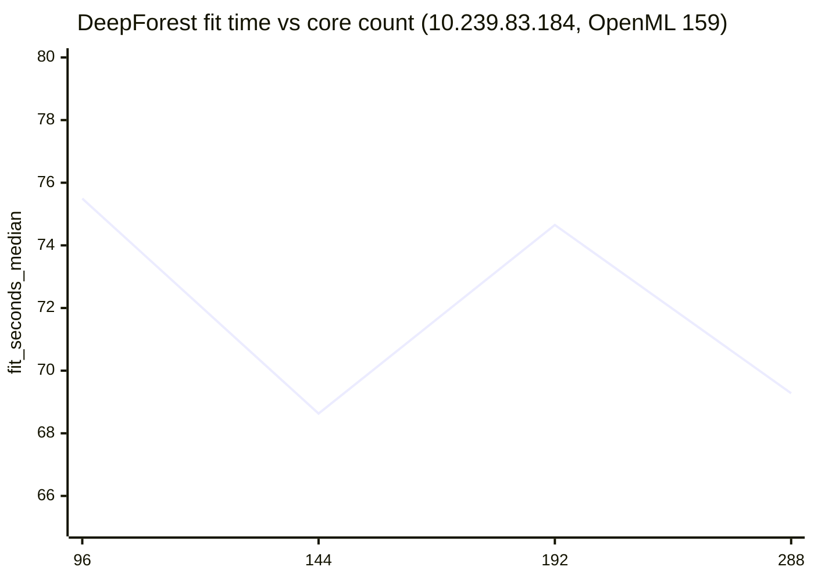
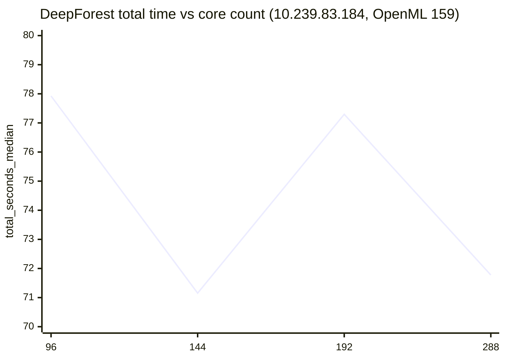
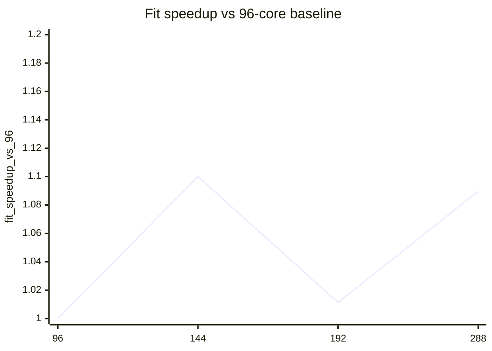
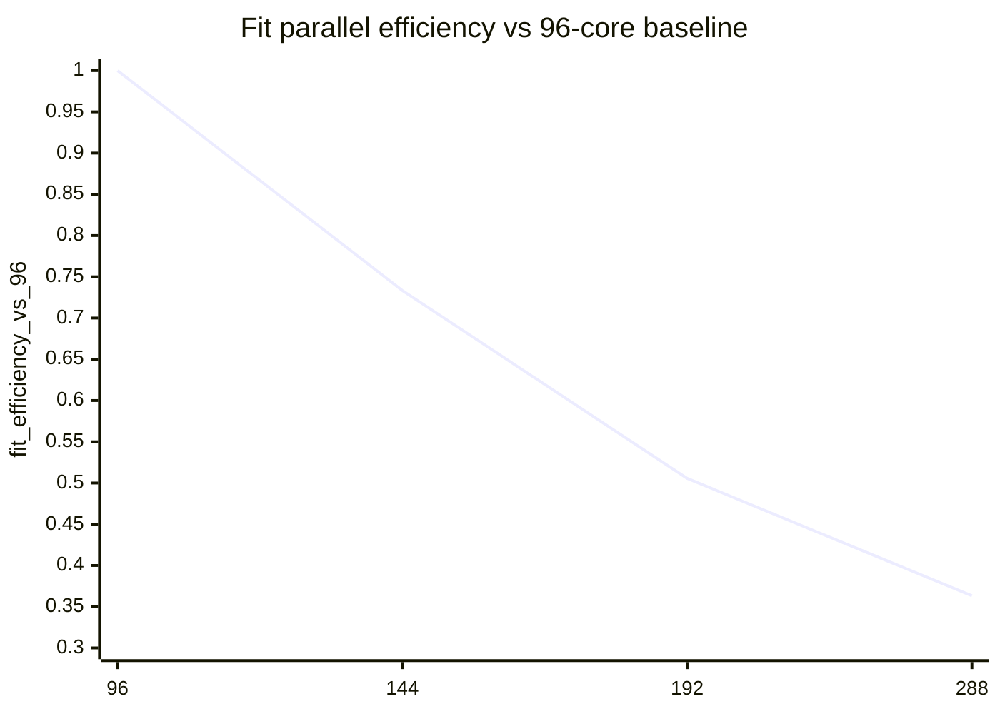

# Scaling analysis on 10.239.83.184 / hpcserver (OpenML 159, DeepForest)

This note summarizes the real `n_jobs` scaling sweep collected on `10.239.83.184` (`hpcserver`) for the current configuration.

Sources:
- raw scaling summary: `results/scaling_184_96to288_v2/scaling_analysis.json`
- terminal table: `results/scaling_184_96to288_v2/scaling_analysis.txt`
- representative run summaries:
  - `results/scaling_184_96to288_v2/summary_n144.json`
  - `results/scaling_184_96to288_v2/summary_n288.json`
- dataset metadata: OpenML dataset 159 (`RandomRBF_50_1E-3`) https://www.openml.org/
- DeepForest package reference: https://pypi.org/project/deep-forest/0.1.7/

Test conditions:
- host: `10.239.83.184` / `hpcserver`
- CPU: `Intel(R) Xeon(R) 6966P-C`
- topology: `2 sockets`, `96 cores/socket`, `2 threads/core`, `384 CPUs visible`, `6 NUMA nodes`
- workload: OpenML did `159`
- core points: `96, 144, 192, 288`
- repeats per point: `1`
- warmup runs: `0`
- baseline point for scaling analysis: `96` cores

## Key result

- Best fit time: `144` cores, `68.629826 s`
- Best total time: `144` cores, `71.152916 s`
- `288` cores is close to `144` cores but still slightly slower (`69.277085 s` vs `68.629826 s`)
- `192` cores is unexpectedly worse than both `144` and `288`
- Accuracy is constant at `53.4095%` across all tested core counts

Interpretation:
- Scaling from `96 -> 144` exists, but it is modest (`1.10x` fit speedup)
- `192` lands on a worse part of the topology / scheduling curve for this workload
- `288` recovers some performance relative to `192`, but still does not beat `144`
- The best tested point on this machine is also `144` cores

## Raw table

| n_jobs | fit_seconds_median | total_seconds_median | fit_speedup_vs_96 | fit_efficiency_vs_96 | total_speedup_vs_96 | total_efficiency_vs_96 |
|---:|---:|---:|---:|---:|---:|---:|
| 96  | 75.494157 | 77.926184 | 1.000000 | 1.000000 | 1.000000 | 1.000000 |
| 144 | 68.629826 | 71.152916 | 1.100020 | 0.733346 | 1.095193 | 0.730129 |
| 192 | 74.652356 | 77.295707 | 1.011276 | 0.505638 | 1.008157 | 0.504078 |
| 288 | 69.277085 | 71.775358 | 1.089742 | 0.363247 | 1.085696 | 0.361899 |

## Fit-time chart

## Total-time chart

## Speedup chart

## Efficiency chart

## Reading guide

What the charts show:
- The best tested point is `144` cores.
- The performance curve is not monotonic: `192` is noticeably worse than `144` and even worse than `288`.
- Efficiency drops quickly once the run moves beyond `144` cores.

Practical conclusion:
- On `hpcserver`, `144` cores is also the best tested operating point for this workload.
- `192` is a bad operating point for this benchmark and should not be treated as a smooth continuation of scaling.
- `288` is competitive with `144`, but still slightly slower and much less efficient.
- Compared with `yi-cwf`, this machine also peaks around `144` cores, but its high-core curve is more irregular, likely due to socket/NUMA placement and memory-access effects.
