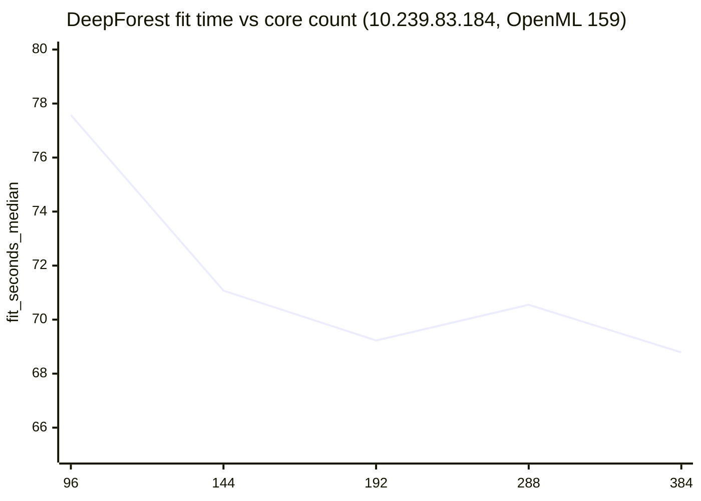
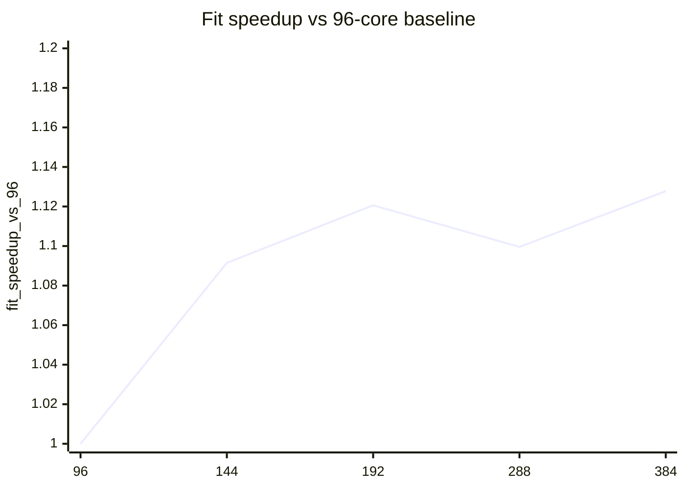
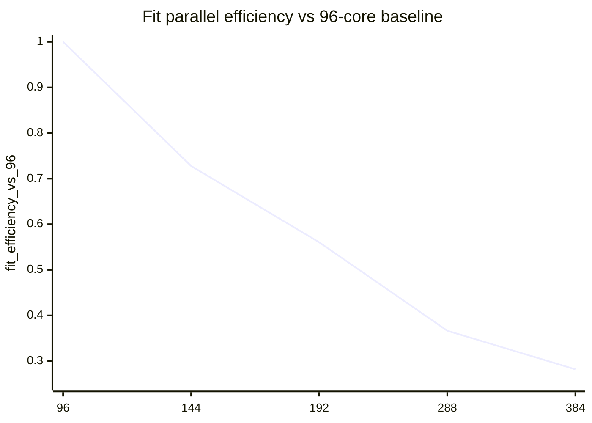

# Scaling analysis on 10.239.83.184 / hpcserver (OpenML 159, DeepForest)

This note summarizes the real `n_jobs` scaling sweep collected on `10.239.83.184` (`hpcserver`) for the current configuration.

Sources:
- raw scaling summary: `results/scaling_184_96to384_v1/scaling_analysis.json`
- terminal table: `results/scaling_184_96to384_v1/scaling_analysis.txt`
- representative run summaries:
  - `results/scaling_184_96to384_v1/summary_n144.json`
  - `results/scaling_184_96to384_v1/summary_n288.json`
  - `results/scaling_184_96to384_v1/summary_n384.json`
- dataset metadata: OpenML dataset 159 (`RandomRBF_50_1E-3`) https://www.openml.org/
- DeepForest package reference: https://pypi.org/project/deep-forest/0.1.7/

Test conditions:
- host: `10.239.83.184` / `hpcserver`
- CPU: `Intel(R) Xeon(R) 6966P-C`
- topology: `2 sockets`, `96 cores/socket`, `2 threads/core`, `384 CPUs visible`, `6 NUMA nodes`
- workload: OpenML did `159`
- core points: `96, 144, 192, 288, 384`
- repeats per point: `1`
- warmup runs: `0`
- baseline point for scaling analysis: `96` cores

## Key result

- Best fit time: `384` cores, `68.785441 s`
- Best total time: `384` cores, `71.184283 s`
- `192` is already strong (`69.226232 s`), but `384` is the best tested point in this complete sweep
- `288` is slightly slower than both `192` and `384`
- Accuracy is constant at `53.4095%` across all tested core counts

Interpretation:
- Scaling from `96 -> 144 -> 192` is real
- The machine does continue to improve at the full `384` visible vCPU point
- The high-core curve is still non-monotonic because `288` is worse than `192` and `384`
- This is not a smooth scaling profile, but the best tested point is now the full-vCPU point, not `144`

## Raw table

| n_jobs | fit_seconds_median | total_seconds_median | fit_speedup_vs_96 | fit_efficiency_vs_96 | total_speedup_vs_96 | total_efficiency_vs_96 |
|---:|---:|---:|---:|---:|---:|---:|
| 96  | 77.574735 | 80.152939 | 1.000000 | 1.000000 | 1.000000 | 1.000000 |
| 144 | 71.073055 | 73.673592 | 1.091479 | 0.727653 | 1.087947 | 0.725298 |
| 192 | 69.226232 | 71.610131 | 1.120597 | 0.560299 | 1.119296 | 0.559648 |
| 288 | 70.550359 | 73.254292 | 1.099565 | 0.366522 | 1.094174 | 0.364725 |
| 384 | 68.785441 | 71.184283 | 1.127778 | 0.281945 | 1.125992 | 0.281498 |

## Fit-time chart

## Total-time chart

## Speedup chart

## Efficiency chart

## Reading guide

What the charts show:
- The best tested point is now `384` cores.
- The curve is still irregular: `288` underperforms relative to both `192` and `384`.
- Efficiency keeps dropping as core count rises, even though absolute runtime still improves slightly at `384`.

Practical conclusion:
- On `hpcserver`, the best tested absolute runtime comes from the full `384` visible vCPU point.
- `192` is already close to the optimum and much more efficient.
- `288` is not a good operating point for this benchmark on this machine.
- The main takeaway is that this host does not peak at `144`; it benefits slightly from going all the way to `384`, but with poor efficiency.
